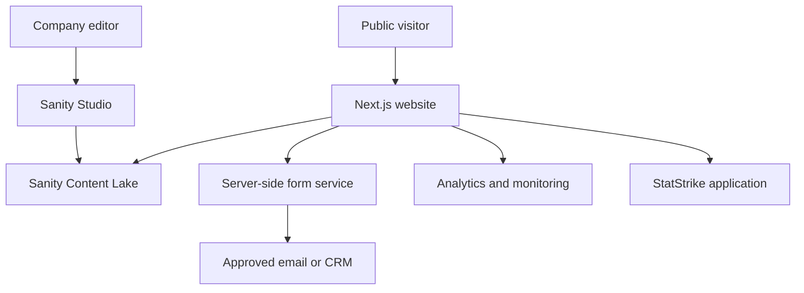
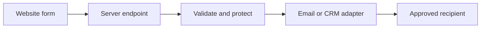

# BeSportify Website — Technical Architecture

## 1. Document control

- Version: 2.0
- Date: 23 August 2026
- Status: Draft for owner and technical review
- Depends on: `PRD.md`
- Intended readers: developers, technical administrators, product owners, future maintainers, and implementation agents

## 2. Purpose

This document explains how the public BeSportify website, Sanity editorial workspace, external integrations, and existing StatStrike application fit together. It should allow a new developer to understand the system without relying on undocumented knowledge from the original builder.

## 3. Architecture principles

1. Separate the public website, CMS, forms, and StatStrike application.
2. Allow company users to maintain content without changing code.
3. Give editors controlled schemas, not an unrestricted page builder.
4. Treat business approval separately from technical publication.
5. Keep generated public pages available during temporary CMS failure.
6. Apply least privilege to users, browser code, and server integrations.
7. Keep unselected form, analytics, monitoring, and anti-spam providers behind adapters.
8. Document setup, deployment, access, recovery, and editorial operations.

## 4. System boundaries

### 4.1 Public website

The website renders BeSportify pages, reads approved Sanity content, displays optimized media, accepts enquiries, links to StatStrike, generates SEO output, and records approved analytics events.

It does not manage StatStrike authentication, match/player data, dashboards, subscriptions, or application access.

### 4.2 Sanity Studio

Sanity authenticates invited company users, provides structured content forms, manages media and drafts, supplies protected visual preview, maintains versions, and publishes approved content.

Sanity is not the StatStrike operational database and should not store website enquiry submissions by default.

### 4.3 StatStrike application

The authenticated product remains separate. The corporate website links to a configured application URL. No shared database, authentication session, or deployment dependency is assumed in V1.

### 4.4 External services

- Enquiry delivery: provider selected before integration
- Spam/rate limiting: provider selected before launch
- Analytics and error monitoring: providers selected before launch
- Hosting: Vercel recommended for the Next.js website

## 5. High-level architecture



## 6. Recommended technology stack

| Layer | Technology | Decision rationale |
|---|---|---|
| Web framework | Next.js App Router | Server rendering, static generation, metadata, routing, deployment support |
| Language | TypeScript strict mode | Reliable content types and maintainability |
| Styling | Tailwind CSS and CSS design tokens | Consistent responsive system without runtime styling cost |
| CMS | Sanity Content Lake and Sanity Studio | Structured content, media, drafts, preview, versions, company access |
| CMS integration | Official supported Sanity/Next.js packages | First-party integration and typed query workflow |
| Queries | GROQ with explicit projections | Controlled, efficient, publication-safe data access |
| Rich text | Restricted Sanity Portable Text | Structured articles without arbitrary HTML |
| Validation | Sanity schema validation and Zod at runtime boundaries | Editorial guidance plus authoritative server validation |
| Forms | Next.js server endpoint/action plus provider adapter | Secrets and delivery remain server-side |
| Tests | Vitest, Testing Library, Playwright | Unit, component, integration, and critical end-to-end coverage |
| Hosting | Vercel | Preview deployments and natural Next.js operation |

Confirm packages against current official documentation during implementation. Experimental or alpha APIs require explicit production review.

## 7. Repository strategy

Use a dedicated repository for the corporate website and Sanity Studio configuration.

```text
besportify-web/
├── public/
│   ├── brand/
│   ├── fallbacks/
│   └── social/
├── src/
│   ├── app/
│   │   ├── (marketing)/
│   │   │   ├── page.tsx
│   │   │   ├── products/page.tsx
│   │   │   ├── products/statstrike/page.tsx
│   │   │   ├── services/page.tsx
│   │   │   ├── case-studies/page.tsx
│   │   │   ├── case-studies/[slug]/page.tsx
│   │   │   ├── insights/page.tsx
│   │   │   ├── insights/[slug]/page.tsx
│   │   │   ├── about/page.tsx
│   │   │   ├── team/page.tsx
│   │   │   ├── careers/page.tsx
│   │   │   └── contact/page.tsx
│   │   ├── api/
│   │   │   ├── contact/route.ts
│   │   │   ├── preview/enable/route.ts
│   │   │   └── preview/disable/route.ts
│   │   ├── privacy/page.tsx
│   │   ├── terms/page.tsx
│   │   ├── layout.tsx
│   │   ├── not-found.tsx
│   │   ├── robots.ts
│   │   └── sitemap.ts
│   ├── components/
│   │   ├── content/
│   │   ├── forms/
│   │   ├── layout/
│   │   ├── sections/
│   │   └── ui/
│   ├── lib/
│   │   ├── analytics/
│   │   ├── forms/
│   │   ├── sanity/
│   │   │   ├── client.ts
│   │   │   ├── fetch.ts
│   │   │   ├── image.ts
│   │   │   ├── queries.ts
│   │   │   └── types.ts
│   │   ├── env.ts
│   │   └── metadata.ts
│   ├── styles/globals.css
│   └── types/
├── sanity/
│   ├── schemaTypes/
│   │   ├── documents/
│   │   ├── objects/
│   │   └── index.ts
│   ├── structure/
│   ├── validation/
│   └── presentation/
├── tests/
│   ├── e2e/
│   ├── integration/
│   └── unit/
├── docs/
│   ├── EDITOR_GUIDE.md
│   ├── OPERATIONS.md
│   └── CONTENT_MODEL.md
├── .env.example
├── sanity.cli.ts
├── sanity.config.ts
├── next.config.ts
├── package.json
└── tsconfig.json
```

`admin.besportify.com` is the approved Studio address. It may use the same repository while remaining a distinct deployment and origin.

## 8. Content architecture

### 8.1 Document types

- `siteSettings`: approved company details and default SEO singleton
- `product`: StatStrike initially, expandable later
- `productCapability`: status-controlled product capability
- `service`: BeSportify service offering
- `partner`: organization, logo, exact relationship, approval
- `caseStudy`: evidence-led project story
- `insight`: editorial article
- `author`: Insight author identity
- `category`: controlled Insight classification
- `teamMember`: approved public profile
- `career`: active, scheduled, closed, or archived opening
- `testimonial`: permission-controlled quotation
- `metric`: evidence-backed quantitative claim
- `callToAction`: reusable approved CTA

### 8.2 Shared objects

- `seo`: title, description, canonical override, social image, no-index control
- `approvedImage`: asset, alt text, caption, credit, source, permission, hotspot/crop
- `link`: internal route or validated external URL
- `approval`: status, owner, reviewer, dates, notes
- `portableText`: limited rich-text blocks

### 8.3 References and duplication

Reference partners, authors, categories, testimonials, and reusable assets. Avoid copying relationship wording into multiple pages because corrections would diverge. Denormalize only inside frontend query projections.

### 8.4 Slugs and redirects

- Slugs are required and type-unique for case studies and Insights.
- Published slugs are not casually changed.
- A slug change requires a redirect before publication.
- Editors cannot create arbitrary top-level routes.

## 9. Studio information architecture

Use business language and this navigation:

1. Website Settings
2. Products
3. Services
4. Partners
5. Case Studies
6. Insights
7. Team
8. Careers
9. Testimonials and Metrics
10. Media Guidance

Hide technical documents from ordinary editors where possible. Singleton documents cannot be duplicated. Document previews show meaningful titles and approval/publication states, not internal IDs.

## 10. Roles and security model

### Approved launch model

- Administrator: primary owner and named backup only
- Publisher: product owner and one trusted backup
- Editor: designated marketing/content employees
- Contributor: limited draft authors where supported

Sanity plan capabilities must be confirmed before implementation. Hiding Studio controls improves usability but does not enforce security.

### Security requirements

- Invite individuals; never share accounts
- Enable suitable MFA/SSO options where supported
- Review access quarterly and immediately after departures/role changes
- Use the lowest-privilege token for every server function
- Never expose preview/read tokens in ordinary browser bundles
- Restrict CORS to approved local, preview, production, and Studio origins
- Pin a fixed Sanity API version date and update deliberately
- Use `published` perspective in production
- Use `drafts` perspective only in authenticated preview

## 11. Content delivery and caching

### Production flow

1. A server component calls the central Sanity fetch wrapper.
2. The wrapper executes an explicit projection using `published` perspective.
3. The query filters business approval, visibility, feature status, expiry, and career state.
4. The result is cached according to page behavior.
5. Static/server-rendered HTML is sent to visitors.

### Revalidation

Prefer the current stable official Sanity live-content/revalidation approach at implementation time. Otherwise use signed webhooks with targeted tags or paths. Do not mix invalidation strategies without a documented reason.

Publication updates only affected content where practical. A failed update must not remove the previously rendered page.

### Failure behavior

- Existing cached/static pages continue to serve
- A new uncached page shows a controlled not-found/service state if needed
- CMS errors are recorded without tokens or query internals
- CMS failure does not break contact routing or StatStrike links

## 12. Draft preview and visual editing

Use Sanity Presentation/Visual Editing for authenticated draft preview.

1. Editor opens Presentation in Studio.
2. Studio calls a protected website endpoint to enable Next.js Draft Mode.
3. Preview uses `drafts` perspective and an appropriate server token.
4. Editor sees draft content in the actual responsive page.
5. Click-to-edit mappings open the relevant field where supported.
6. Exiting preview clears Draft Mode.

Requirements:

- Preview secrets remain server-only
- Preview routes reject arbitrary redirects and invalid requests
- Drafts are never indexed, publicly cached, or included in sitemap/feeds
- Browser tokens, if required by the supported official method, are restricted to authenticated Draft Mode
- Visual-editing metadata must not affect production text or analytics

## 13. Media architecture

- Sanity stores image assets; document fields store alt text, caption, crop, and hotspot
- Use stable official image URL tooling and Next-compatible rendering
- Define MIME types, size limits, and aspect-ratio guidance per placement
- Require alt text unless explicitly decorative
- Record credit, source, and permission for third-party photography and logos
- Do not accept arbitrary SVG from editors; trusted brand SVG remains code-managed or sanitized through a controlled process
- Do not upload large video without a selected delivery strategy
- Render a safe fallback for missing/deleted assets

## 14. Frontend component architecture

- `ui`: accessible generic primitives without business copy
- `layout`: header, footer, navigation, containers
- `sections`: approved composed marketing sections
- `content`: typed Sanity/Portable Text renderers
- `forms`: fields, validation, submission states, accessible feedback

Content renderers must accept projected types, handle optional fields intentionally, reject unsupported blocks, avoid raw HTML rendering, and preserve semantic headings and accessible media.

## 15. Form architecture

Sanity will not store demo/contact/career submissions by default.



Requirements:

- Shared Zod schemas and authoritative server validation
- Rate limiting, honeypot, and selected bot protection
- Duplicate-submit handling where practical
- Generic user errors and safe diagnostic logs
- Explicit consent and retention policy
- No full message bodies in analytics
- Show success only after provider acceptance

## 16. Environment contract

Names are illustrative until initialization:

```text
NEXT_PUBLIC_SITE_URL=
NEXT_PUBLIC_STATSTRIKE_APP_URL=
NEXT_PUBLIC_SANITY_PROJECT_ID=
NEXT_PUBLIC_SANITY_DATASET=
NEXT_PUBLIC_SANITY_API_VERSION=
SANITY_PREVIEW_READ_TOKEN=
SANITY_PREVIEW_SECRET=
CONTACT_PROVIDER_API_KEY=
CONTACT_DESTINATION=
CAREERS_DESTINATION=
ANALYTICS_ID=
RATE_LIMIT_PROVIDER_URL=
RATE_LIMIT_PROVIDER_TOKEN=
```

Only intentionally public configuration uses `NEXT_PUBLIC_`. Secrets differ across local, preview, and production environments. `.env.example` documents names and purposes but contains no values.

## 17. SEO architecture

- Central metadata builder with page overrides
- Published and business-approved content only
- Organization/WebSite structured data from verified settings
- Product structured data only when truthful
- Article and Breadcrumb structured data for published Insights
- Sitemap excludes drafts, archives, expired careers, and no-index records
- Robots policy blocks preview/admin surfaces where applicable
- Social images use approved assets or code-generated templates with verified text

## 18. Performance requirements

- Server components by default
- Static generation/caching for stable public content
- Minimal client hydration
- Accurate responsive image sizes and explicit dimensions
- Font subsetting/self-hosting where permitted
- No heavy autoplay hero video in V1
- Third-party scripts only after business/privacy approval
- GROQ projections return only needed fields and resolve required references efficiently

## 19. Testing strategy

### Unit and integration

- Publication/approval filters
- Environment validation
- Metadata and URL helpers
- Form schemas
- Content transformations and rich-text renderers
- Query projections using representative fixtures/test data
- Draft versus published behavior
- Status/expiry filtering and media fallbacks

### End-to-end

- Public navigation and responsive layouts
- Demo flow and StatStrike redirect
- Authenticated preview enable/disable
- Publication leading to page refresh/revalidation
- Draft/unapproved content absent publicly
- Career expiry behavior

### Editorial acceptance

A non-developer completes: sign in → create → upload/crop/add alt text → preview → request approval → publisher publishes → verify public page → unpublish/restore.

## 20. Deployment architecture

Recommended domains:

- `besportify.com`: public website
- `www.besportify.com`: redirect or canonical host, chosen once
- `admin.besportify.com`: Sanity Studio
- `app.besportify.com`: future approved StatStrike domain

Environments: local development, pull-request preview, and production.

Use one production dataset initially unless content risk justifies a separate staging dataset. Draft preview already provides editorial staging; code previews remain separate deployments.

## 21. CI/CD

Every change runs formatting/check, lint, typecheck, tests, and production build. Pull requests create previews; production deploys from protected main.

Schema changes are additive and migration-aware. Frontend renderers remain compatible during rollout. Never remove or rename a live field in the same deployment step that introduces its replacement.

## 22. Setup guide for a future developer

1. Obtain approved repository, Vercel, Sanity, and environment access.
2. Install the documented Node LTS and locked package manager.
3. Clone the repository and create `.env.local` from `.env.example`.
4. Install dependencies from the lockfile.
5. Start the website and Studio using committed scripts.
6. Confirm local origin is permitted in Sanity CORS settings.
7. Verify production uses published content and preview uses drafts.
8. Run all verification scripts before editing.
9. Make schema changes additively, migrate content if required, and then update projections/renderers.
10. Deploy a preview, complete editorial/responsive QA, and merge through the protected workflow.

Exact commands belong in the repository README and package scripts after initialization.

## 23. Operational ownership

| Area | Primary owner | Backup/requirement |
|---|---|---|
| Domain/DNS | `[ASSIGN]` | named backup |
| Vercel | `[ASSIGN]` | technical backup |
| Sanity administration | Product/technical owner | one trusted backup administrator |
| Content publishing | Product owner | one trusted backup Publisher |
| Partner claim approval | Business owner | documented delegate |
| Forms/privacy | `[ASSIGN]` | retention owner |
| Incident response | `[ASSIGN]` | escalation contact |

## 24. Decisions still requiring owner input

1. Named primary and backup administrators
2. Named backup Publisher
3. Sanity plan after role and preview verification
4. Public or private dataset; public is normally adequate for public marketing content when drafts and sensitive material are governed correctly, while private delivery adds cost and server authentication
5. Form/CRM, analytics, monitoring, and bot-protection providers
6. Canonical domain: apex or `www`
7. Enquiry and careers retention period

## 25. Definition of architecture complete

Architecture is implementation-ready when Section 24 has owners or approved defaults, Sanity role enforcement is verified, the content model is reviewed by editorial users, security/token boundaries are approved, form/privacy retention has an owner, and a new maintainer can follow setup, preview, publication, deployment, and recovery without relying on the original developer.
